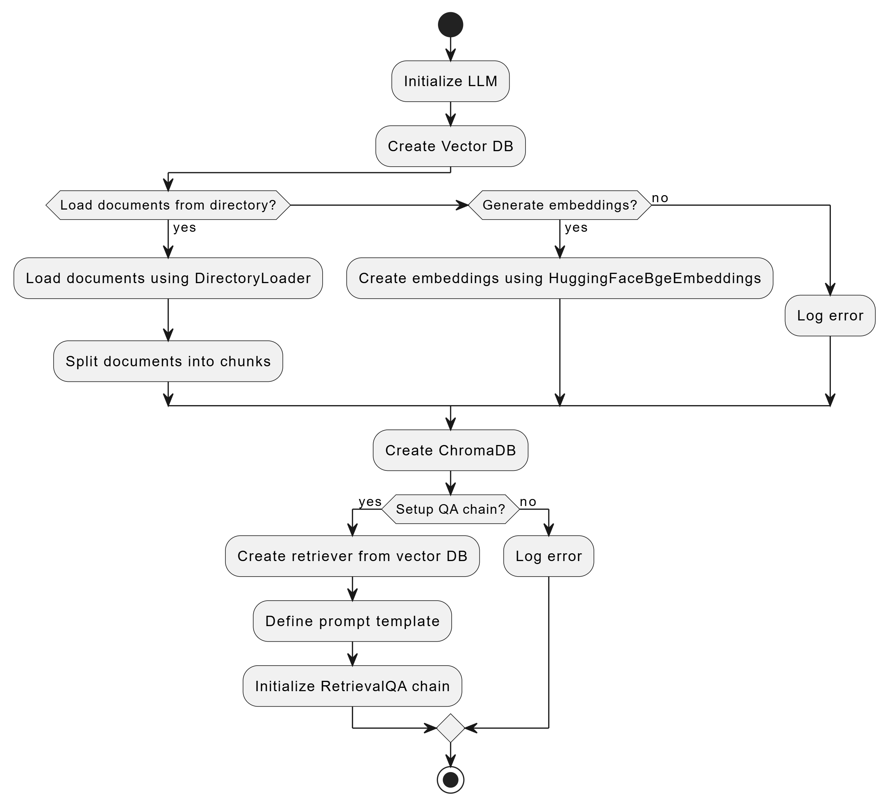
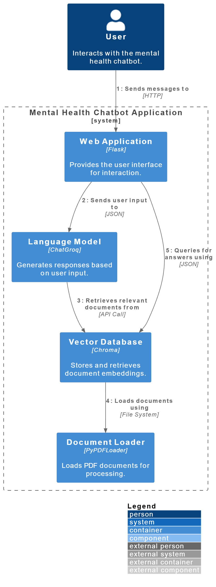
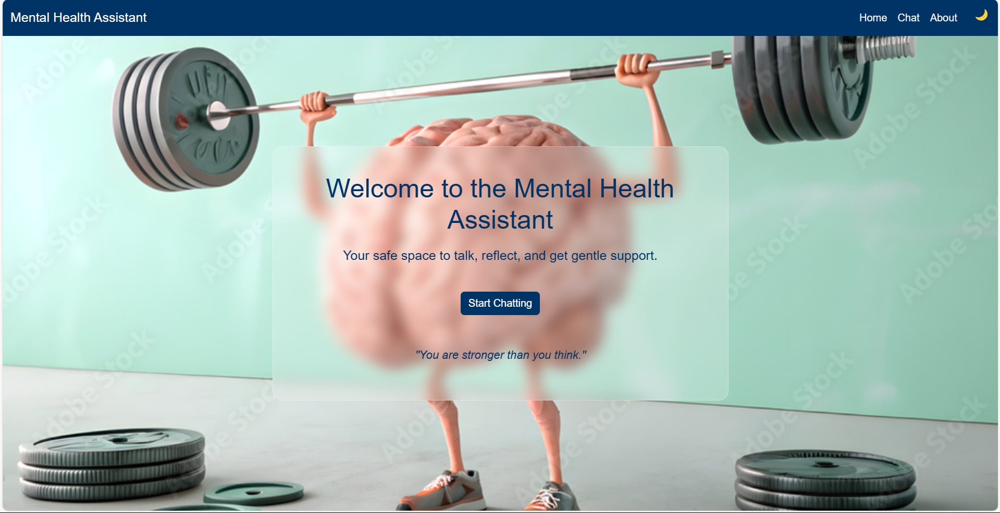
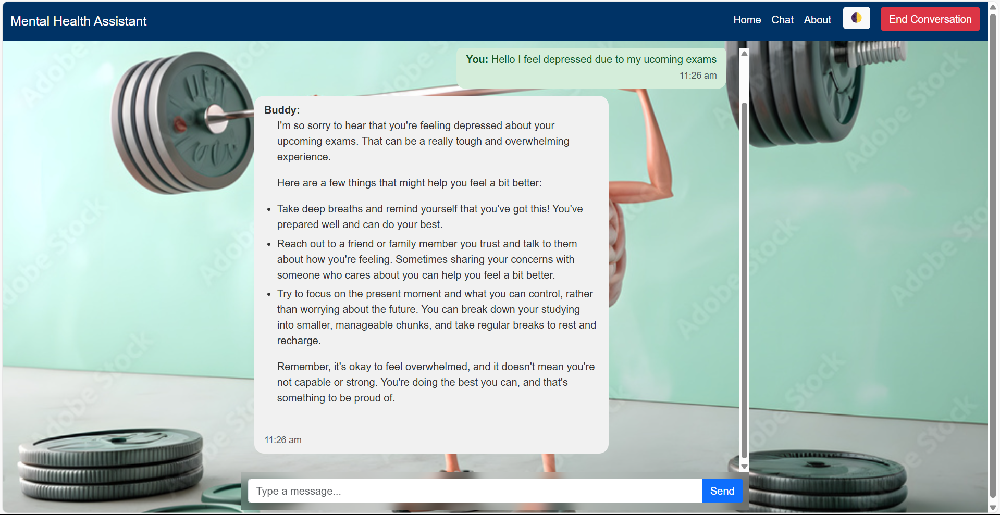
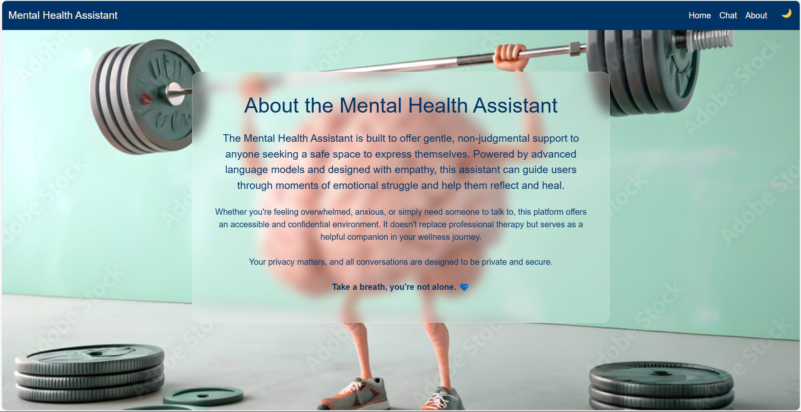

# 🧠 **Mental Health Chatbot**

A conversational AI chatbot for mental health support, powered by **Groq API** and a **local PDF knowledge base**, built with **Langchain**, **Flask**, and **HuggingFace embeddings**.

---

## 🚀 **Features**

- **Natural language interaction**
- **Context-aware answers**
- Powered by **Groq LLMs** (Mistral, Mixtral, etc.)
- **Local PDF document integration**
- **Web-based chat interface** (Flask)

---

## 🛠️ **Tech Stack**

- 🧠 **Groq LLMs** (via Groq API) — super fast inference
- 🔗 **Langchain** — for managing prompts, chains, and memory
- 🧾 **HuggingFace Transformers & Embeddings**
- 🐍 **Python**
- 🌐 **Flask** — lightweight web server and UI
- 📄 **PyMuPDF (fitz)** — for parsing local PDF documents

---

## 🌐 **Groq API Setup**

1. Go to the [Groq API Platform](https://console.groq.com/keys).
2. Create a free account if you don’t have one.
3. Generate an API key.
4. Save it as an environment variable:

```bash
export GROQ_API_KEY=your-groq-api-key
```

Or on Windows CMD:

```cmd
set GROQ_API_KEY=your-groq-api-key
```

---

## ⚙️ **Local Setup**

### 1. **Clone the repo**

```bash
git clone https://github.com/your-username/mental-health-chatbot.git
cd mental-health-chatbot
```

### 2. **Create and activate the virtual environment**

#### For Linux/macOS:
```bash
python3 -m venv venv
source venv/bin/activate
```

#### For Windows:
```bash
python -m venv venv
venv\Scripts\activate
```

*After activation, you should see `(venv)` in your terminal prompt.*

### 3. **Install dependencies**

```bash
pip install -r requirements.txt
```

### 4. **Set the environment variable for Groq API**

```bash
export GROQ_API_KEY=your-groq-api-key
```

*(Alternatively, use a `.env` file with `python-dotenv` to manage environment variables.)*

---

## ▶️ **Run the App**

```bash
python app.py
```

Then open your browser and go to:  
👉 `http://127.0.0.1:5000`

---

## 📂 **Folder Structure**

```bash
FLASK-CHATBOT/
├── app.py
├── chatbot.py
├── templates/
│   ├── index.html
│   ├── home.html
│   └── about.html
├── static/
│   └── styles.css
├── data/
│   ├── Brain Energy PDF.pdf
│   └── mental_health_Document.pdf
├── requirements.txt
└── README.md
```

---

## 💡 **TODO / Coming Soon**

- **Save chat history**
- **Authentication for multiple users**
- **More personalized mental health prompts**

---

## 🖼️ **Flow Chart of Mental Health Chatbot**


---

## 🖼️ **System Architecure Diagram of Mental Health Chatbot**


---

## 🖼️ **UI Images**

### 1. **Home Page:**

The homepage of the chatbot can feature a welcoming interface that introduces users to the mental health chatbot and provides options to start a conversation or access helpful resources.



### 2. **Chat Page:**

Once the user begins interacting, the chat page would provide a dynamic interface where they can ask questions and receive real-time responses.



### 3. **About Section:**

The about section would give users insight into the purpose of the chatbot, the technology behind it, and how it can support them emotionally.



---

## 📬 **Contact**

Built with ❤️ for educational and emotional support.

---
